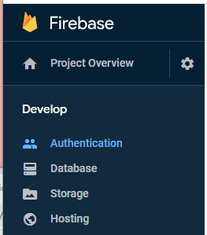
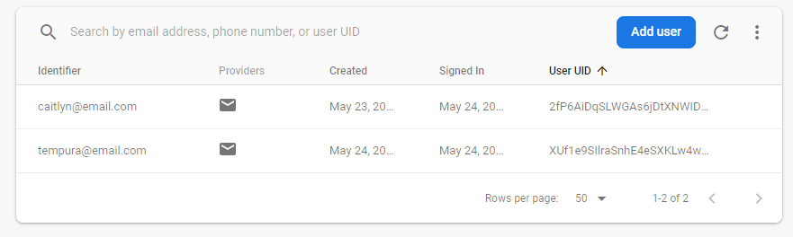
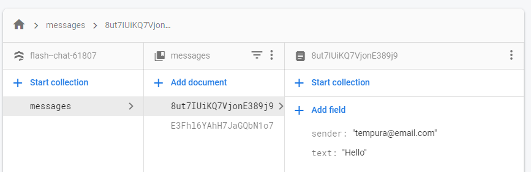

# Flash Chat ⚡️

## Our Goal

The objective of this tutorial is to learn how to incorporate Firebase into our Flutter apps. We'll be using Firebase Cloud Firestore as well as the Firebase authentication package to equip our app with a cloud-based NoSQL database and secure authentication methods. 


## What you will create

We’re going to build a modern messaging app where users can sign up and log in to chat.


## What you will learn

- How to incorporate Firebase into your Flutter projects.
- How to use Firebase authentication to register and sign in users.
- How to create beautiful animations using the Flutter Hero widget.
- How to create custom aniamtions using Flutter's animation controller. 
- Learn all about mixins and how they differ from superclasses.
- Learn about Streams and how they work.
- Learn to use ListViews to build scrolling views.
- How to use Firebase Cloud Firestore to store and retrieve data on the fly.

---
---

# Named Routes
I used [named routes](https://flutter.dev/docs/cookbook/navigation/named-routes) to navigate between screens with the `Navigator` function. The first step is to define the routes in the `main.dart` file using a map called `routes`. I also changed the `home` property to `initialRoute`.

```dart
initialRoute: WelcomeScreen.id,
routes: {
    WelcomeScreen.id : (context) => WelcomeScreen(),
    LoginScreen.id: (context) => LoginScreen()
}
```

The second step is to navigate to the second screen using `Navigator.pushNamed()` when the button is pressed.

```dart
 onPressed: () {
    Navigator.pushNamed(context, RegistrationScreen.id);
    },
```
# Static Const

The static keyword is used to hold variables or methods inside a class so that you can access it without creating a new object. When a variable is static, you just need to put the class name in front of the variable when you want to use it. 

```dart
// welcome_screen.dart
static const String id = 'welcome_screen';

// main.dart
initialRoute: WelcomeScreen.id,
```
---
---

# Hero Animation
The hero animation is a simple animation that only requires 3 steps. The first step is to create 2 Hero Widgets in 2 separate files. The second step is to create a shared tag property. The final step is to make navigator-based screen transitions so that the animation will occur when the screen is changed.

```dart

// welcome_screen.dart

// Step 1: 
Hero(
    // Step 2: 
    tag: 'logo',
    child: Container(
    child: Image.asset('images/logo.png'),
    height: 60.0,
    ),
),

//login_screen.dart
Hero(
    tag: 'logo',
    child: Container(
    height: 200.0,
    child: Image.asset('images/logo.png'),
    ),
    ),

// Step 3: 
Navigator.pushNamed(context, LoginScreen.id);


```

# Custom Animations
The `AnimationController` object manages an animation. This object outputs numbers from 0.0 to 1.0 by default. To implement the animation, the user must pass in a `vsync` argument and use a `.forward()` method.  

```dart
AnimationController controller;

 controller = AnimationController(
      duration: Duration(seconds: 1),
      vsync: this,
    );

controller.forward();
```

## Curved Animation
These animations apply a curve to another animation. The [Curves class](https://api.flutter.dev/flutter/animation/Curves-class.html) has several types of animation curves such as `Curves.decelerate` and `Curves.easeIn`. 

## Tween
The tween class has a flexible range and is useful for animating between two values. I specifically used the `ColorTween` to animate between two different colors.  

```dart
animation = ColorTween(begin: Colors.blueGrey, end: Colors.white).animate(controller);
```

---
---

# Mixin
Mixins are a body of code that can be reused within various classes and help the organization of the program. It uses the keyword `mixin` when defining the functionality. A class can call multiple mixins using the `with` keyword.

```dart
mixin CanSwim {
  void swim() {
    print('Changing position by swimming');
  }
}

class Duck extends Animal with CanSwim, CanFly {
  
}
```

---
---

# Prepackaged Animations
The pub.dev site has many prepackaged animations that are easy to incorporate into your own code. For example, there are [animated_text_kit](https://pub.dev/packages/animated_text_kit), [sprung](https://pub.dev/packages/sprung), and [rubber](https://pub.dev/packages/rubber) animations. 


```dart
 TypewriterAnimatedTextKit(
    speed: Duration(milliseconds: 500),
    totalRepeatCount: 1,
    text: ['Flash Chat'],
    textStyle: TextStyle())
```

# Firebase
[Firebase](https://firebase.google.com/) is a development platform created by Googlethat includes various functionility to improve your app. For example, Firebase is a real-time database, file storage, authentication system, hosting system and more. 

## FirebaseAuth
The [firebase_auth](https://pub.dev/packages/firebase_auth) plugin helps authenticate the user and create a new user object.

```dart
final _auth = FirebaseAuth.instance;

//create a NEW user
final newUser = await _auth.createUserWithEmailAndPassword(email: email, password: password);

//login an EXISTING user
final signedInUser = await _auth.signInWithEmailAndPassword(email: email, password: password);
```

## Firestore
The Cloud Firestore is a NoSQL database that stores data between the client and server. I used the [cloud_firestore](https://pub.dev/packages/cloud_firestore) plugin to utilize the database and add data collections from my app. 

```dart
 onPressed: () {
  _firestore.collection('messages').add({
    'text': messageText,
    'sender': loggedInUser.email,
  });
},
```

## Firebase WebPage Console



The [Firebase console](https://console.firebase.google.com/u/0/project/flash--chat-61807/overview) has a webpage to manage your projects.



One of the tools allows the developer to view the various users who signed into the app.



Another tool displays a collection of data that holds a map of the user's email and messages. This map is customizable and is set up by the developer. 


# Modal Progress Hud
The [modal_progress_hud](https://pub.dev/packages/modal_progress_hud) plugin creates a widget display to indicate a screen is loading.

```dart
body: ModalProgressHUD(
  inAsyncCall: showSpinner,
  child: Padding(...),
  onPressMethod: () async {
    setState(() {
      showSpinner = true;
    });
)

```

